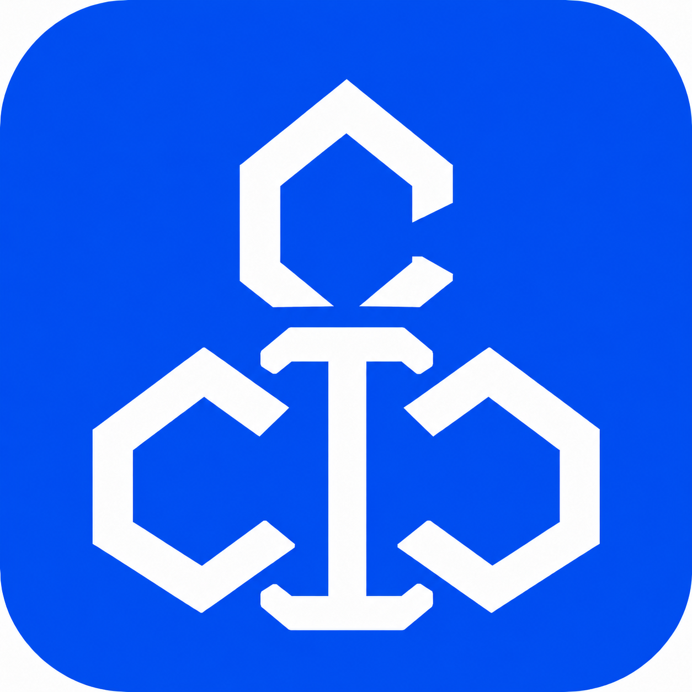
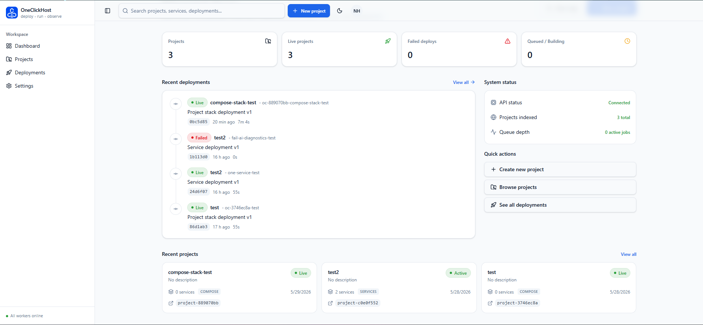
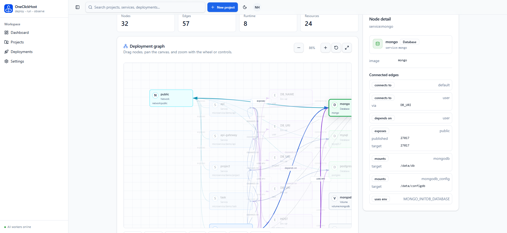
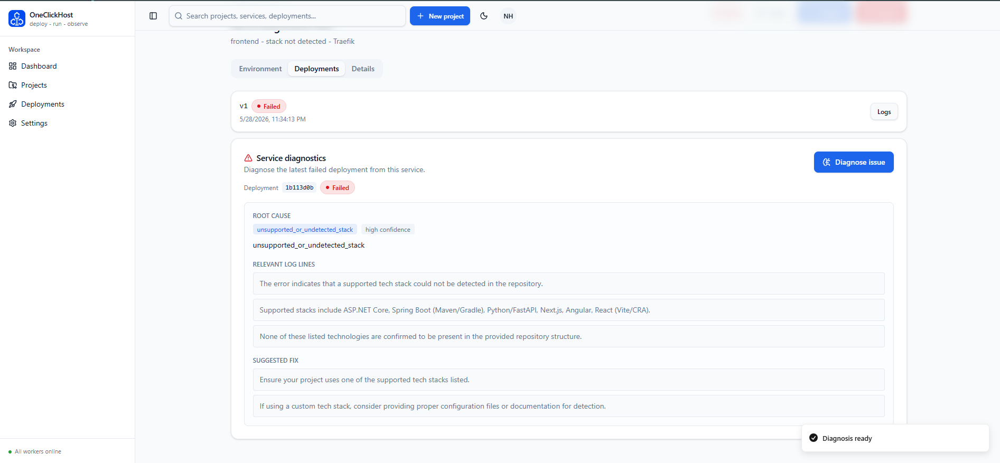
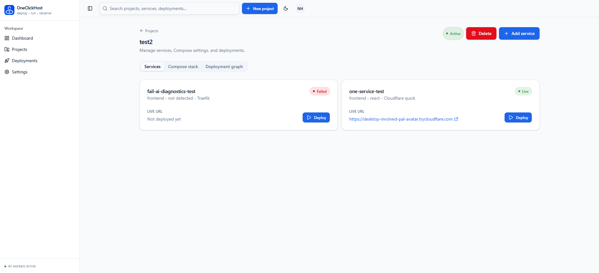

<p align="center">
  
</p>

# OneClick-Host 🚀

<p align="center">
  <strong>A Premium Self-Hosted Platform as a Service (PaaS)</strong><br />
  <em>Deploy your GitHub repositories with a single click. Zero DevOps, Maximum Control.</em>
</p>

---

OneClick-Host is a sophisticated, self-hosted deployment platform engineered for researchers, students, and small project teams. It serves as your private cloud infrastructure—similar to Vercel or Heroku—but entirely under your control. Simply provide a GitHub repository, and the platform handles the rest: stack detection, automated containerization, and live deployment with dynamic routing.

## Product Screenshots

### Dashboard



### Compose Stack Graph



### AI Deployment Diagnosis



### Cloudflare Quick Tunnel



## ✨ Core Features

*   **⚡ Zero-Config Deployments:** Just paste your GitHub URL and watch the magic happen.
*   **🔍 Intelligent Stack Detection:** Automatically recognizes React, Next.js, ASP.NET Core, and Spring Boot.
*   **📦 Automated Dockerization:** Generates optimized `Dockerfile`s on the fly, adhering to production best practices.
*   **🌐 Dynamic Routing:** Seamlessly maps apps to subdomains (e.g., `http://frontend-forum.localhost`) via Traefik.
*   **📂 Monorepo Support:** Deploy specific subdirectories with ease—perfect for full-stack monorepos.
*   **📊 Real-Time Logs:** Native streaming of Docker build logs directly in your dashboard.
*   **🧠 AI Deployment Diagnosis:** Failed deployments capture a compact diagnostic snapshot and can be analyzed from the dashboard.

## 🏗️ Technical Architecture

The platform leverages a robust microservices architecture orchestrated via Docker Compose:

| Component | Technology Stack | Responsibility |
|:---|:---|:---|
| **🎨 Frontend** | React 19, Vite 7, Tailwind CSS 4 | Modern dashboard for managing projects, Compose deployments, and logs. |
| **⚙️ API** | ASP.NET Core (.NET 10) | High-performance REST API managing state and deployment queues. |
| **🤖 Worker** | Python 3.12 | Orchestration daemon using Docker SDK for cloning, building, and running. |
| **🗄️ Database** | PostgreSQL 16 | Reliable persistence for project configurations and build history. |
| **🛣️ Proxy** | Traefik v3.4 | Edge router providing dynamic load balancing and subdomain management. |
| **🧠 AI Diagnosis** | OpenAI Responses API | Optional one-shot analysis of failed deployment diagnostic snapshots. |

### The Deployment Pipeline

1. **Submission:** User enters a GitHub URL in the Next.js Dashboard.
2. **Queuing:** ASP.NET API validates the request and queues a `Pending` job in PostgreSQL.
3. **Detection:** The Python Worker clones the repo and executes `stack_detector.py`.
4. **Generation:** If no `Dockerfile` exists, `dockerfile_generator.py` injects a custom-tailored template.
5. **Execution:** `build_runner.py` builds the image and deploys the container to the internal `oneclick-net`.
6. **Routing:** A YAML routing configuration is generated for Traefik, enabling instant global access.

When a deployment fails, the worker stores a diagnostic snapshot before cleanup. The snapshot includes the failed step, detected stack when available, a bounded log excerpt, a compact repository tree, and selected relevant files. The dashboard can then request a stored one-shot AI diagnosis without re-cloning the repository or re-running the deployment.

### Cloudflare Quick Tunnel Preview URLs

Compose routes and single service deployments can optionally use Cloudflare Quick Tunnel instead of Traefik. This starts a managed `cloudflare/cloudflared` sidecar for the selected HTTP service and publishes it through a temporary `https://*.trycloudflare.com` URL.

Quick Tunnel mode does not require a Cloudflare account, token, or domain. It is intended for demos and previews: URLs are temporary and can change after redeploys or restarts. Database and Redis services remain internal-only. Use Traefik or a named Cloudflare Tunnel for stable production domains.

## 💻 Supported Ecosystems

OneClick-Host provides first-class support for the following stacks out of the box:

- **Frontend:** React (Vite/CRA), Next.js
- **Backend:** ASP.NET Core (.NET 10), Java Spring Boot (Maven/Gradle)

> [!TIP]
> Have a custom environment? Just include your own `Dockerfile` in the root of your repository, and OneClick-Host will prioritize it!

## 🚀 Getting Started

### Prerequisites
- Docker & Docker Compose
- Git

### Installation & Setup

1. **Clone the Repo:**
   ```bash
   git clone https://github.com/HienMinh58/oneclick-host.git
   cd oneclick-host
   ```

2. **Create Environment File:**
   ```bash
   cp .env.example .env
   ```

   Fill in required values in `.env`.

3. **Launch Infrastructure:**
   ```bash
   docker compose up -d --build
   ```

4. **Access Your Dashboard:**
   - **Dashboard:** [http://localhost:3000](http://localhost:3000)
   - **API Docs:** [http://localhost:5000/swagger](http://localhost:5000/swagger)
   - **Traefik Hub:** [http://localhost:8081](http://localhost:8081)

### Optional AI Diagnosis Setup

AI diagnosis is disabled until an API key is configured in `.env`:

```env
AI_PROVIDER=OpenAI
AI_API_KEY=your_openai_api_key
AI_MODEL=gpt-4o-mini
```

After changing `.env`, recreate the API container so the backend receives the new environment variables:

```bash
docker compose up -d --force-recreate api
```

To verify the API container has the key without printing it:

```bash
docker exec oneclick-api sh -lc 'test -n "$AI__ApiKey" && echo configured || echo missing'
```

Never put real API keys in `.env.example`; keep secrets only in `.env` or your deployment secret manager.

## 🌍 Production Deployment

The approved MVP release target is a two-node AWS topology with invite-only
access. The control plane stores accounts and project state; the private
execution node runs every user workload. Until a domain is purchased, the
dashboard/API use CloudFront HTTPS and user apps use temporary Cloudflare Quick
Tunnel HTTPS URLs.

Read these documents before deploying:

- [`docs/architecture-two-node-mvp.md`](docs/architecture-two-node-mvp.md)
- [`docs/mvp-release-roadmap.md`](docs/mvp-release-roadmap.md)
- [`docs/multi-node-compose-runbook.md`](docs/multi-node-compose-runbook.md)

The release remains `NO-GO` until the roadmap exit gates pass.

### Multi-Node Compose Deploy

The invite-only production pilot is Compose-only. Run API, PostgreSQL,
frontend, and the dispatcher on the control-plane VM; run `WORKER_MODE=executor`
on an execution-node VM in the same VPC/private network. Execution nodes
register and lease jobs through `/api/execution-nodes/*`; selected user routes
receive temporary HTTPS Cloudflare Quick Tunnel preview URLs. `sslip.io` HTTP
routing remains local/infrastructure diagnostics only and is not a pilot user
flow.

The public fixture repo target is:

```text
https://github.com/tuankiet18-dev/oneclick-compose-fixture
```

The same fixture contents are also kept locally under
`fixtures/oneclick-compose-fixture` for review and manual push.

For the lowest-cost AWS production pilot in Singapore, use
`infra/aws/mvp`. It creates one public control-plane EC2 instance,
one private-only execution-node EC2 instance, one Elastic IP, no NAT Gateway, no
ALB, and no RDS. The control-plane acts as a small NAT instance so the private
execution-node can clone public GitHub repos and pull images without a second
public IPv4 address.

## 🛡️ CI/CD & Reliability

Our internal pipeline ensures stability across all components:
- **Frontend/Backend:** Automated builds and linting.
- **Worker:** Strict Python syntax validation and Docker SDK integration tests.
- **Docker:** Infrastructure validation for complex multi-container setups.

## 📄 License

This project is licensed under the MIT License.
