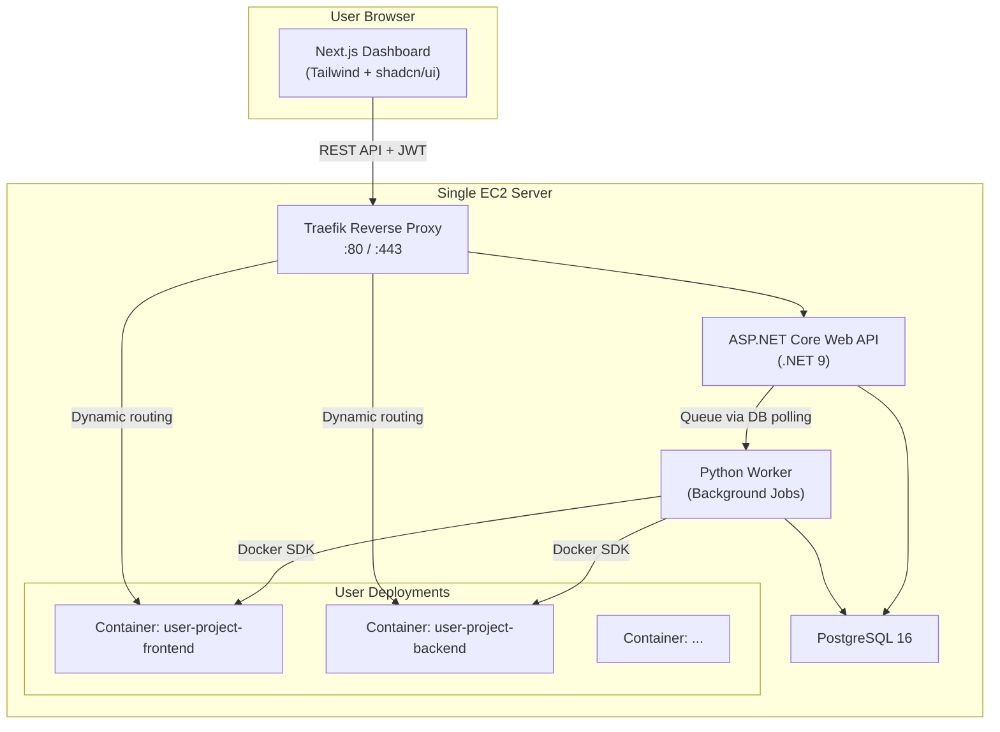
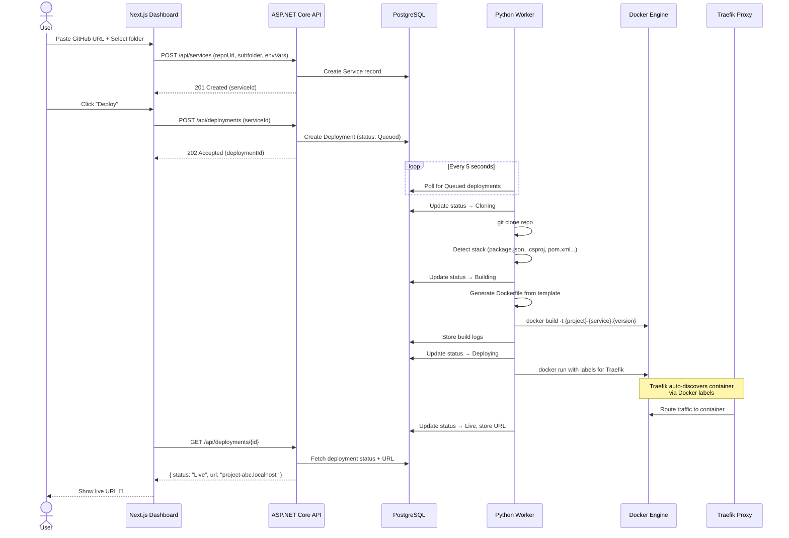
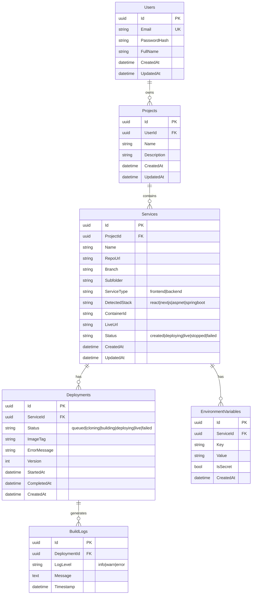

# OneClick-Host MVP — Implementation Plan

## Overview

**OneClick-Host** is a SaaS web app that lets students and small project teams deploy their GitHub repos with zero DevOps knowledge. Users paste a GitHub URL → system detects the stack → builds with Docker → deploys on a single EC2 server → returns a live URL.

---

## 1. Recommended Architecture



### Service Responsibilities

| Service | Tech | Responsibility |
|---------|------|----------------|
| **Dashboard** | Next.js 15, Tailwind CSS, shadcn/ui | User-facing UI: auth, project management, logs, deployment status |
| **API** | ASP.NET Core (.NET 9), EF Core, PostgreSQL | REST API, JWT auth, CRUD for projects/services/deployments, job queuing |
| **Worker** | Python 3.12 | Clone repos, detect stacks, generate Dockerfiles, build images, run containers, stream logs |
| **Database** | PostgreSQL 16 | Persistent storage for all entities |
| **Traefik** | Traefik v3 | Reverse proxy, automatic HTTPS (later), dynamic routing for user deployments |

### Communication Pattern (MVP simplification)

Instead of introducing RabbitMQ/Redis for job queuing, the MVP uses **database polling**:
1. API creates a `Deployment` record with status `Queued`
2. Worker polls the DB every 5 seconds for `Queued` deployments
3. Worker picks up the job, sets status to `Building`, then `Deploying`, then `Live` or `Failed`
4. Dashboard polls API for status updates (upgrade to WebSocket/SSE later)

> [!TIP]
> This avoids adding message broker complexity. When you scale beyond 1 server, swap DB polling for Redis/RabbitMQ.

---

## 2. Monorepo Folder Structure

```
d:\oneClick\
├── README.md
├── docker-compose.yml                # Local development orchestration
├── docker-compose.prod.yml           # Production overrides (later)
├── .env.example                      # Environment variables template
├── .gitignore
│
├── frontend/                         # Next.js Dashboard
│   ├── Dockerfile
│   ├── package.json
│   ├── next.config.ts
│   ├── tailwind.config.ts
│   ├── tsconfig.json
│   ├── components.json               # shadcn/ui config
│   ├── src/
│   │   ├── app/
│   │   │   ├── layout.tsx
│   │   │   ├── page.tsx
│   │   │   ├── globals.css
│   │   │   ├── (auth)/
│   │   │   │   ├── login/page.tsx
│   │   │   │   └── register/page.tsx
│   │   │   ├── dashboard/
│   │   │   │   ├── layout.tsx
│   │   │   │   ├── page.tsx
│   │   │   │   └── projects/
│   │   │   │       ├── page.tsx
│   │   │   │       ├── [id]/
│   │   │   │       │   ├── page.tsx
│   │   │   │       │   └── services/
│   │   │   │       │       └── [serviceId]/page.tsx
│   │   │   └── providers.tsx
│   │   ├── components/
│   │   │   └── ui/                   # shadcn/ui components
│   │   ├── lib/
│   │   │   ├── api.ts                # API client
│   │   │   └── auth.ts               # Auth helpers
│   │   └── types/
│   │       └── index.ts              # TypeScript interfaces
│   └── public/
│
├── backend/                          # ASP.NET Core Web API
│   ├── Dockerfile
│   ├── OneClickHost.Api/
│   │   ├── OneClickHost.Api.csproj
│   │   ├── Program.cs
│   │   ├── appsettings.json
│   │   ├── appsettings.Development.json
│   │   ├── Controllers/
│   │   │   ├── AuthController.cs
│   │   │   ├── ProjectsController.cs
│   │   │   ├── ServicesController.cs
│   │   │   └── DeploymentsController.cs
│   │   ├── Models/
│   │   │   ├── User.cs
│   │   │   ├── Project.cs
│   │   │   ├── Service.cs
│   │   │   ├── Deployment.cs
│   │   │   ├── BuildLog.cs
│   │   │   └── EnvironmentVariable.cs
│   │   ├── DTOs/
│   │   │   ├── Auth/
│   │   │   ├── Projects/
│   │   │   ├── Services/
│   │   │   └── Deployments/
│   │   ├── Data/
│   │   │   ├── AppDbContext.cs
│   │   │   └── Migrations/
│   │   ├── Services/
│   │   │   ├── AuthService.cs
│   │   │   ├── ProjectService.cs
│   │   │   ├── ServiceService.cs
│   │   │   └── DeploymentService.cs
│   │   └── Middleware/
│   │       └── JwtMiddleware.cs
│   └── OneClickHost.Api.sln
│
├── worker/                           # Python Worker
│   ├── Dockerfile
│   ├── requirements.txt
│   ├── main.py                       # Entry point (polling loop)
│   ├── config.py                     # Configuration
│   ├── db.py                         # Database connection
│   ├── modules/
│   │   ├── __init__.py
│   │   ├── repo_cloner.py            # Git clone logic
│   │   ├── stack_detector.py         # Detect tech stack
│   │   ├── dockerfile_generator.py   # Generate Dockerfile from templates
│   │   ├── build_runner.py           # Docker build & run
│   │   └── log_parser.py            # Parse and store build logs
│   └── templates/                    # Dockerfile templates
│       ├── aspnet.Dockerfile
│       ├── springboot-maven.Dockerfile
│       ├── springboot-gradle.Dockerfile
│       ├── react.Dockerfile
│       └── nextjs.Dockerfile
│
├── traefik/                          # Traefik configuration
│   ├── traefik.yml                   # Static config
│   └── dynamic/                      # Dynamic config directory
│       └── dashboard.yml
│
└── scripts/                          # Helper scripts
    ├── init-db.sql                   # Database initialization
    └── setup.sh                      # First-time setup script
```

---

## 3. Main Data Flow: Repo URL → Live Deployment



### Detailed Steps

| Step | Component | Action |
|------|-----------|--------|
| 1 | Dashboard | User creates a project and adds a service with GitHub URL |
| 2 | API | Validates input, creates `Service` record in DB |
| 3 | Dashboard | User clicks "Deploy" button |
| 4 | API | Creates `Deployment` record with status `Queued` |
| 5 | Worker | Polls DB, picks up queued deployment |
| 6 | Worker | Clones the repo (or specific subfolder) using `git` |
| 7 | Worker | Runs stack detection on the cloned files |
| 8 | Worker | Generates a Dockerfile from the matching template |
| 9 | Worker | Builds Docker image via Docker SDK |
| 10 | Worker | Stops any previous container for this service |
| 11 | Worker | Runs new container with Traefik labels for routing |
| 12 | Traefik | Auto-discovers the new container, routes `{service-name}.{domain}` to it |
| 13 | Worker | Updates deployment status to `Live` with the URL |
| 14 | Dashboard | Shows the live URL to the user |

---

## 4. Database Schema



---

## 5. API Endpoints

### Authentication
| Method | Endpoint | Description |
|--------|----------|-------------|
| POST | `/api/auth/register` | Register new user |
| POST | `/api/auth/login` | Login, returns JWT |
| GET | `/api/auth/me` | Get current user profile |

### Projects
| Method | Endpoint | Description |
|--------|----------|-------------|
| GET | `/api/projects` | List user's projects |
| POST | `/api/projects` | Create new project |
| GET | `/api/projects/{id}` | Get project details |
| DELETE | `/api/projects/{id}` | Delete project and all services |

### Services
| Method | Endpoint | Description |
|--------|----------|-------------|
| GET | `/api/projects/{projectId}/services` | List services in a project |
| POST | `/api/projects/{projectId}/services` | Create a new service |
| GET | `/api/services/{id}` | Get service details |
| PUT | `/api/services/{id}` | Update service config |
| DELETE | `/api/services/{id}` | Delete service (stops container) |
| POST | `/api/services/{id}/restart` | Restart the service container |
| POST | `/api/services/{id}/stop` | Stop the service container |

### Deployments
| Method | Endpoint | Description |
|--------|----------|-------------|
| POST | `/api/services/{serviceId}/deploy` | Trigger new deployment |
| GET | `/api/services/{serviceId}/deployments` | List deployments |
| GET | `/api/deployments/{id}` | Get deployment status |
| GET | `/api/deployments/{id}/logs` | Get build/runtime logs |

### Environment Variables
| Method | Endpoint | Description |
|--------|----------|-------------|
| GET | `/api/services/{serviceId}/env` | List env vars |
| PUT | `/api/services/{serviceId}/env` | Bulk update env vars |

---

## 6. Stack Detection Logic (Python)

```python
# Priority-ordered detection rules
DETECTION_RULES = [
    {
        "stack": "aspnet",
        "indicators": [".csproj file exists", "Program.cs exists"],
        "confirm": "contains <Project Sdk=\"Microsoft.NET.Sdk.Web\">"
    },
    {
        "stack": "springboot-maven",
        "indicators": ["pom.xml exists"],
        "confirm": "contains spring-boot-starter"
    },
    {
        "stack": "springboot-gradle", 
        "indicators": ["build.gradle exists"],
        "confirm": "contains org.springframework.boot"
    },
    {
        "stack": "nextjs",
        "indicators": ["package.json exists", "next.config.* exists"],
        "confirm": "package.json has 'next' dependency"
    },
    {
        "stack": "react",
        "indicators": ["package.json exists"],
        "confirm": "package.json has 'react' AND ('vite' or 'react-scripts')"
    }
]
```

---

## 7. Major Risks & Simplifications for MVP

### Risks

| Risk | Impact | Mitigation |
|------|--------|------------|
| **Resource exhaustion** | User containers consume all server RAM/CPU | Set Docker `--memory` and `--cpus` limits per container (256MB RAM, 0.5 CPU) |
| **Security: arbitrary code execution** | Users deploy malicious containers | Use `--network` isolation, read-only volumes, no privileged mode. Limit to known stacks only. |
| **Build times** | Large Spring Boot/ASP.NET builds can take 10+ minutes | Show real-time build logs. Use Docker layer caching. Set a 15-min timeout. |
| **Concurrent builds** | Multiple builds can overload a small server | Process one build at a time (sequential worker). Add concurrency later. |
| **GitHub rate limiting** | Too many clones trigger GitHub rate limits | Cache cloned repos. Support GitHub PAT tokens later. |
| **Secret management** | Environment variables stored in plain text | Encrypt `Value` column for `IsSecret=true` entries. MVP: warn users, full encryption in v2. |

### Simplifications

| Simplification | What we skip | Why it's OK for MVP |
|----------------|-------------|---------------------|
| **DB polling instead of message queue** | No RabbitMQ/Redis | Simpler infra. 1 server = low volume. Easy to swap later. |
| **No CI/CD pipeline** | No GitHub Actions | Users manually click "Deploy". Auto-deploy on push comes in v2. |
| **No custom domains** | Only subdomain routing | `{service}.{project}.localhost` for dev, wildcard domain for prod later. |
| **No scaling** | 1 container per service | MVP is single-server. Scaling = future. |
| **No billing/metering** | Free tier only | Add Stripe billing after validating demand. |
| **Sequential builds** | One build at a time | Prevents resource contention. Good enough for MVP volume. |
| **No WebSocket for logs** | Polling for log updates | Simpler implementation. SSE/WebSocket in v2 for real-time logs. |

---

## 8. Proposed Changes (Implementation Steps)

### Step 1: Root Configuration

#### [NEW] [README.md](file:///d:/oneClick/README.md)
Project overview, setup instructions, architecture diagram, and development workflow.

#### [NEW] [docker-compose.yml](file:///d:/oneClick/docker-compose.yml)
Local development compose with: PostgreSQL, Traefik, API, Worker, Frontend. Includes volumes, networks, health checks.

#### [NEW] [.env.example](file:///d:/oneClick/.env.example)
Template for all environment variables across services.

#### [NEW] [.gitignore](file:///d:/oneClick/.gitignore)
Comprehensive gitignore for .NET, Node.js, Python, Docker, IDE files.

---

### Step 2: ASP.NET Core Backend

#### [NEW] [OneClickHost.Api.sln](file:///d:/oneClick/backend/OneClickHost.Api.sln)
Solution file.

#### [NEW] [OneClickHost.Api.csproj](file:///d:/oneClick/backend/OneClickHost.Api/OneClickHost.Api.csproj)
.NET 9 project with EF Core, Npgsql, JWT Bearer packages.

#### [NEW] [Program.cs](file:///d:/oneClick/backend/OneClickHost.Api/Program.cs)
Configures services: EF Core, JWT, CORS, Swagger, controllers.

#### [NEW] Models: User.cs, Project.cs, Service.cs, Deployment.cs, BuildLog.cs, EnvironmentVariable.cs
Entity classes matching the schema above.

#### [NEW] [AppDbContext.cs](file:///d:/oneClick/backend/OneClickHost.Api/Data/AppDbContext.cs)
EF Core DbContext with all entity configurations.

#### [NEW] DTOs: Registration, login, project/service/deployment request/response DTOs.

#### [NEW] Services: AuthService, ProjectService, ServiceService, DeploymentService.
Business logic layer.

#### [NEW] Controllers: AuthController, ProjectsController, ServicesController, DeploymentsController.
REST API endpoints.

#### [NEW] [Dockerfile](file:///d:/oneClick/backend/Dockerfile)
Multi-stage build: restore → build → publish → runtime.

---

### Step 3: Python Worker

#### [NEW] [main.py](file:///d:/oneClick/worker/main.py)
Entry point with DB polling loop.

#### [NEW] [config.py](file:///d:/oneClick/worker/config.py)
Environment-based configuration.

#### [NEW] [db.py](file:///d:/oneClick/worker/db.py)
PostgreSQL connection using psycopg2.

#### [NEW] Modules: repo_cloner.py, stack_detector.py, dockerfile_generator.py, build_runner.py, log_parser.py
Each module handles one step of the deployment pipeline.

#### [NEW] Templates: aspnet.Dockerfile, springboot-maven.Dockerfile, springboot-gradle.Dockerfile, react.Dockerfile, nextjs.Dockerfile
Production-ready Dockerfile templates for each supported stack.

#### [NEW] [requirements.txt](file:///d:/oneClick/worker/requirements.txt)
Dependencies: psycopg2-binary, docker, gitpython, pyyaml.

#### [NEW] [Dockerfile](file:///d:/oneClick/worker/Dockerfile)
Python 3.12 slim with git and Docker CLI.

---

### Step 4: Next.js Frontend Dashboard

#### [NEW] Next.js 15 app with Tailwind CSS and shadcn/ui
Created via `npx create-next-app@latest` with TypeScript, Tailwind, App Router.

#### [NEW] Pages: Login, Register, Dashboard, Projects, Project Detail, Service Detail
All route pages with placeholder UI components.

#### [NEW] [api.ts](file:///d:/oneClick/frontend/src/lib/api.ts)
Axios/fetch wrapper for API communication with JWT handling.

#### [NEW] [types/index.ts](file:///d:/oneClick/frontend/src/types/index.ts)
TypeScript interfaces matching backend DTOs.

#### [NEW] [Dockerfile](file:///d:/oneClick/frontend/Dockerfile)
Multi-stage: install → build → serve with Node.js.

---

### Step 5: Traefik Configuration

#### [NEW] [traefik.yml](file:///d:/oneClick/traefik/traefik.yml)
Static config: Docker provider, entrypoints, dashboard.

#### [NEW] [dashboard.yml](file:///d:/oneClick/traefik/dynamic/dashboard.yml)
Dynamic routing rules for the dashboard and API.

---

### Step 6: Database Initialization

#### [NEW] [init-db.sql](file:///d:/oneClick/scripts/init-db.sql)
SQL schema creation script (backup for EF migrations).

---

## 9. Verification Plan

### Automated Tests
1. `docker compose up --build` — all 5 services start without errors
2. `dotnet build` — backend compiles
3. `npm run build` — frontend builds
4. `python -c "from modules import stack_detector; print('OK')"` — worker modules import
5. EF Core migration applies cleanly to PostgreSQL

### Manual Verification
1. Register a user via Swagger UI at `http://localhost:8080/swagger`
2. Login and receive JWT token
3. Create a project and service via API
4. Verify database records via pgAdmin or `psql`
5. Frontend loads at `http://localhost:3000`
6. Traefik dashboard accessible at `http://localhost:8081`

---

## Open Questions

> [!IMPORTANT]
> **Domain strategy**: For local development, I'll use `*.localhost` which resolves to 127.0.0.1 automatically. For production, you'll need a wildcard domain (e.g., `*.oneclick-host.com`). Is `localhost` OK for now?

> [!IMPORTANT]
> **GitHub access**: MVP will support public repos only (no auth needed for cloning). Should we add GitHub OAuth / PAT support now, or defer to v2?

> [!IMPORTANT]
> **.NET version**: .NET 9 is stable and available. I'll use .NET 9 unless you prefer .NET 8 LTS. Which do you prefer?

> [!NOTE]
> **Worker concurrency**: The plan uses sequential (one-at-a-time) builds. This is intentional to avoid resource contention on a single server. OK with you?
